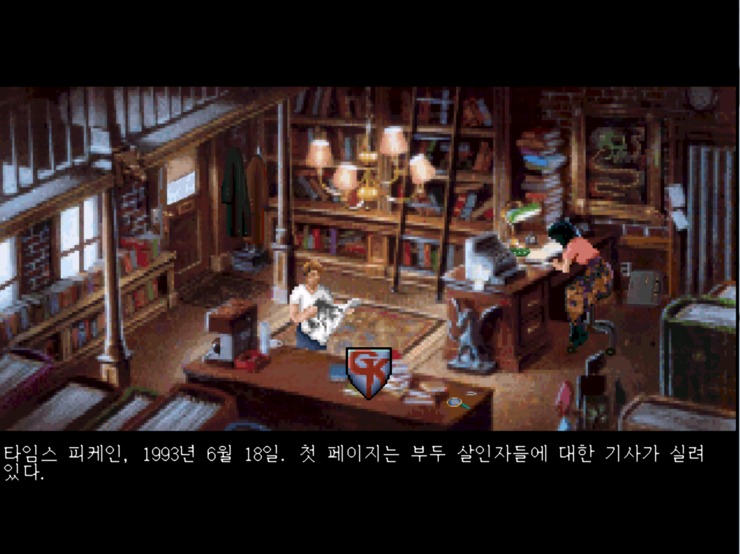

# ✨ 한국어 패치 리스트


**GitBook tip:** A succinct video overview is a great way to introduce folks to your product. Embed a Loom, Vimeo or YouTube video and you're good to go! We love this video from the fine folks at Loom as a perfect example of a succinct feature overview.


## 가브리엘 나이트 1

Get amazing things done with awesome feature one. But remember that awesome feature two and three exist too. In fact, Awesome Product is full of awesome features.

<figure><figcaption></figcaption></figure>

## Awesome Feature Two

Get amazing things done with awesome feature two. But remember that awesome feature one and three exist too. In fact, Awesome Product is full of awesome features.

